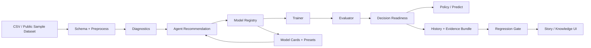

# DeepUplift Agent Architecture Notes

## 30-Second Architecture

DeepUplift Agent separates the causal decision workflow into four layers: **data and schema**, **model registry and adapters**, **decision evaluation**, and **artifact/UI governance**. The UI never calls raw model classes directly; every model goes through the registry, preset, trainer, evaluator, and artifact contracts so different uplift methods can be compared on the same decision surface.

## System Flow

## Component Responsibilities

| Component | Responsibility | Interview Talking Point |
| --- | --- | --- |
| Data schema | Defines treatment, outcome, task, features, split, and decision settings | Avoids hard-coded `main.py` training scripts |
| Diagnostics | Checks outcome type, treatment balance, feature imbalance, missingness, overlap, and leakage risk | Causal modeling starts with design quality, not model choice |
| Model registry | Normalizes model availability, dependencies, prediction contract, and task support | Allows 103 models to appear behind one interface |
| Model cards | Stores assumptions, best-use cases, risks, readiness, and parameter presets | Turns a model zoo into an explainable decision catalog |
| Trainer | Executes training with a shared artifact contract | Makes UI, no-UI smoke, and Agent workflow use the same engine |
| Evaluator | Produces QINI, AUUC, Top-K uplift, calibration, bootstrap, overlap trim, sensitivity, and policy curves | Moves evaluation from metric-only to decision-grade |
| Agent workflow | Orchestrates diagnostics, recommendations, compare runs, ranking, and explanations | Productizes causal workflow instead of adding a passive chat box |
| History/evidence | Saves config, metrics, predictions, readiness, notes, tags, and evidence ZIP | Gives the project an experiment governance story |
| Regression gate | Audits model catalog, model cards, presets, no-UI compare, browser screenshots, and artifacts | Makes the demo reproducible and reviewer-friendly |

## Artifact Contract

Each successful run can produce:

- `config.json`: schema, model, decision settings, and parameters.
- `metrics.json`: QINI, AUUC, calibration, Top-K, policy value, and optional bootstrap metrics.
- `readiness.json`: deployment-readiness level, blockers, and recommended rollout.
- `promotion.json`: research/shadow/pilot promotion gate and next evidence required before launch.
- `environment.json`: Python, package, platform, and git dirty-state snapshot for reproducibility.
- `evidence_manifest.json`: run contract, data fingerprint, readiness summary, and artifact SHA-256 hashes.
- `predictions.csv`: holdout predictions with `y0_pred`, `y1_pred`, and `uplift_score`.
- `train_history.csv`: epoch/iteration metrics when available.
- `run_note.md`: human-readable run explanation.
- `user_note.json`: tags, candidate flag, and operator notes.
- evidence ZIP: portable bundle for review or interview demo.

## Model Strategy

The platform deliberately mixes model families instead of relying on one implementation style:

| Family | Examples | Why It Matters |
| --- | --- | --- |
| Neural uplift | TarNet, CFRNet, DragonNet, DESCN, EFIN, EUEN | Strong representation-learning story for uplift modeling |
| Meta-learners | S/T/X/DR/R, transformed outcome, IPW, domain adaptation | Interpretable baselines and observational-data robustness |
| Industrial boosting | LightGBM, guarded XGBoost/CatBoost families | Practical large-scale tabular deployment path |
| Official CATE frameworks | EconML DML/DR/forest estimators | Shows ability to integrate mature causal ML frameworks |
| Uplift libraries | scikit-uplift Solo/Two/Transform variants | Covers established uplift modeling APIs |
| Ranking/calibration | GGBM, PAV-calibrated DR/R/forest variants | Connects model scores to Top-K targeting reliability |

## Decision Logic

Model ranking should not be explained as “highest QINI wins.” A stronger interview answer is:

1. Check whether the data design is plausible: treatment balance, missingness, leakage, and propensity overlap.
2. Recommend candidate families based on data type and risk: simple baselines first, DR/R learners under selection bias, CFR/DragonNet when representation balance matters.
3. Compare candidates using QINI, AUUC, calibration, bootstrap CI, Top-K observed uplift, policy value, sensitivity, and decision-readiness.
4. Pick the model that gives the best deployable decision, not necessarily the best single offline metric.
5. Export evidence so the decision can be reviewed, repeated, and challenged.

## Resume-Level Summary

> Built a causal decision workbench for growth targeting that converts uplift modeling from scripts into an agent-driven workflow: data diagnostics, model recommendation, multi-model comparison, policy-value simulation, scoring export, evidence packaging, and regression validation across 103 registered models and 73 locally runnable models.
