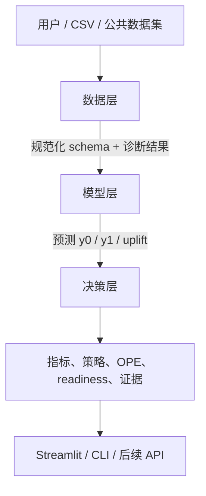

# DeepUplift 三层平台架构

## 目标

把项目从“模型集合 + Streamlit 页面”整理成可持续开源的平台边界：数据层负责输入可信度，模型层负责估计异质处理效应，决策层负责把估计转成可审查的策略证据。

## 1. 数据层

公开入口：`deepuplift.data`。

职责：

- 描述 treatment、outcome、feature、task 和 split；
- 处理数值/类别特征、缺失值和训练/打分列对齐；
- 生成数据指纹、feature profile 和 dataset manifest；
- 在训练前检查 treatment balance、propensity overlap、feature balance、missingness 和潜在 leakage。

主要实现位于 `deepuplift/contracts/`、`deepuplift/data/schema.py`、`preprocessing.py`、`registry.py`、`split.py`、`diagnostics.py` 和 `backends/`。旧的 `deepuplift/core/` 数据模块继续作为兼容路径。

## 2. 模型层

公开模型目录：`deepuplift.models`；统一注册、capability 和 optional adapter 服务位于 `deepuplift/models/registry.py`、`capabilities.py` 和 `adapters/`。旧的 `deepuplift/core/registry.py` 继续服务原 Streamlit 模型目录。

模型层只负责：

- 根据统一配置构建模型；
- 训练并输出 factual outcome、counterfactual outcome 或 CATE/uplift；
- 把不同实现适配到相同的 `fit` / `predict` 契约；
- 声明任务支持、可选依赖、参数 preset、来源和风险。

当前 reference runtime 包含真实可运行的 S/T/X/DR binary baselines、multi-treatment outcome baseline 和 continuous dose-response baseline；EconML/scikit-uplift/CausalML 通过 guarded optional adapters 接入。可运行性取决于本地 Python 和可选依赖，不把“已注册”当成“已验证”。

## 3. 决策层

公开入口：`deepuplift.decision`。

职责：

- 用 QINI/AUUC 衡量排序，用 Top-K uplift 和 calibration 检查人群质量；
- 用 bootstrap、overlap trim、sensitivity 和 nuisance diagnostics 检查稳定性；
- 用 policy value、ROI/iROAS、预算/触达约束和 OPE 将分数转成策略；
- 输出 readiness、promotion gate、run artifacts 和 evidence manifest。

决策层不应只按单个 QINI 选模型，也不应把离线 policy value 解释成线上 lift。上线前还需要随机化实验、灰度、监控、回滚和隐私/合规流程。

## 兼容策略

`deepuplift.core` 暂时保留为内部应用服务和旧版兼容层，以避免破坏现有脚本和用户代码。后续可以按以下顺序继续迁移：

1. 为 multi/continuous policy 补充统一的 `PolicyResult` 适配；
2. 把 legacy trainer 和 artifact writer 拆进 application/runtime；
3. 为 optional backends 增加真实 estimator mapping 和版本矩阵；
4. 为每一步保留兼容导入和 contract tests，再删除旧路径。
